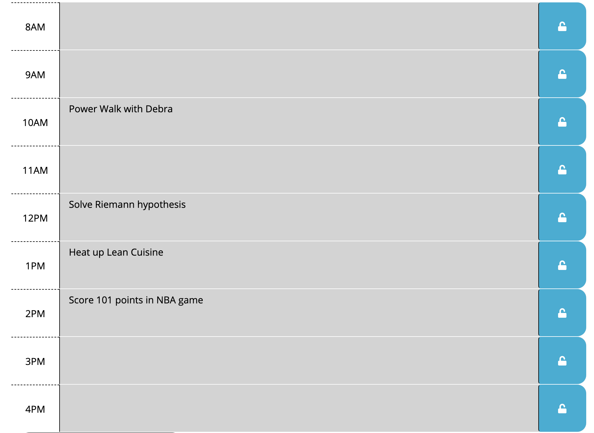
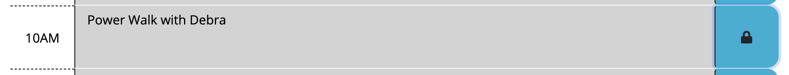
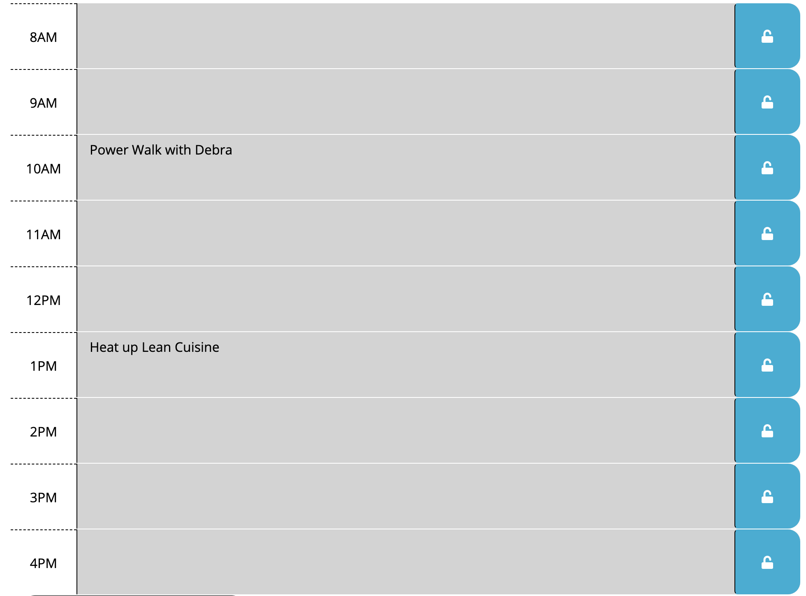
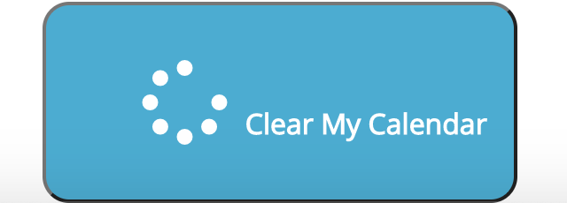
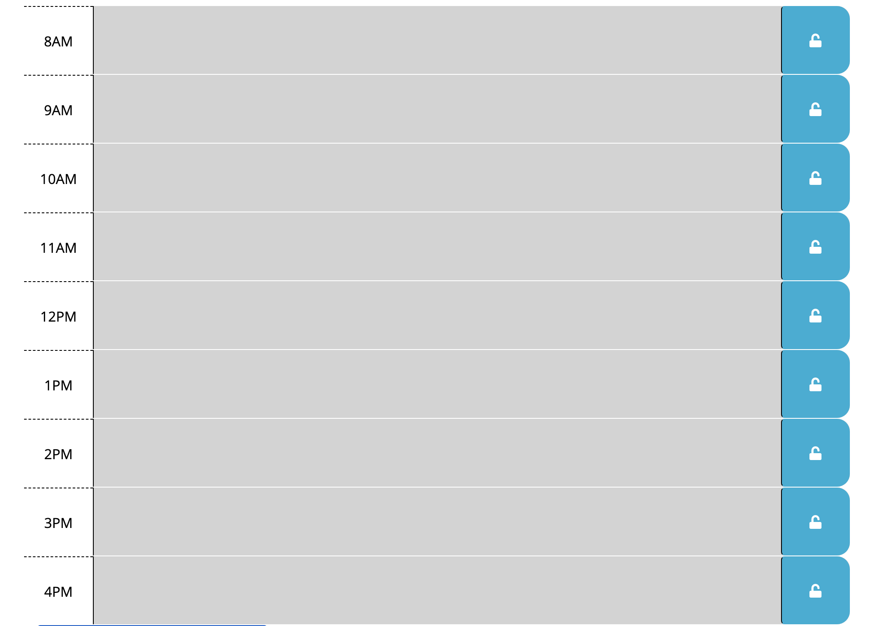

“How we spend our days is of course how we spend our lives. What we do with this hour and that one is what we are doing.” - Annie Dillard

This app helps you time block your days and help you get organized for living your life, today. Which day is it, exactly? That's displayed at the top of the page. 

The present time is in a nice red color, so you can focus on the task at hand. Everything in the past is greyed out, and everything you can look forward to is in a bright green color. 

If you know that you like to speed walk with Debra in the morning, you can just jot that down in the 10am block. Alsong with whatever else you have planned for the day.

You won't need to repeat certain things, but you can hit the lock to the right of the appointments you do want to keep daily.

The next time you reload the page, only those important tasks will appear.

If ever you want a Clean Slate, you can clear your calendar faster than you can heat up that Lean Cuisine by hitting Clear Calendar at the bottom of the calendar.

You're ready for anything!

