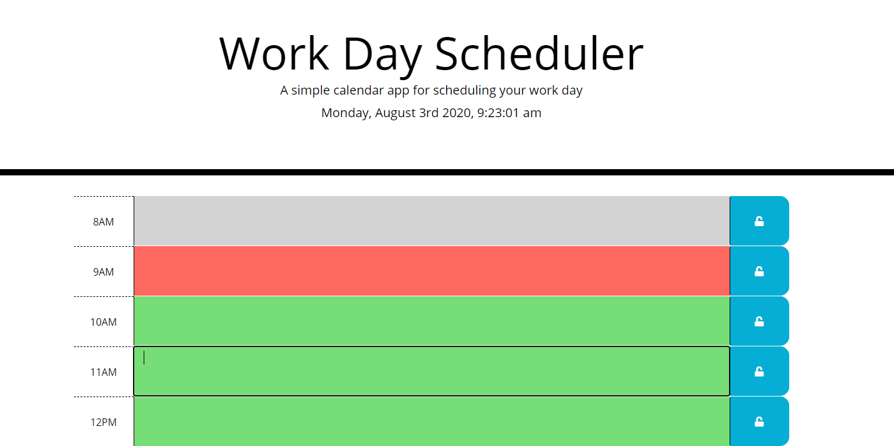

“How we spend our days is of course how we spend our lives. What we do with this hour and that one is what we are doing.” - Annie Dillard

This app helps you time block your days and help you get organized for living your life, today. Which day is it, exactly? That's displayed at the top of the page. 

The present time is in a nice red color, so you can focus on the task at hand. 
Everything in the past is greyed out, and everything you can look forward to is in a bright green color. 

If you know that you like to speed walk with Debra in the morning, you can just jot that down in the 10am block. Along with whatever else you have planned for the day.

If certain tasks aren't important, you don't have to save them, but for the ones that are, you can hit the lock to the right of the appointments. Now you have that appointment locked in for today, tomorrow, and everyday for the next 10 years *gulp*.

The next time you reload the page, only those important tasks will appear.

If ever you want a fresh start, just hit Clear Calendar at the bottom of the calendar.

You're ready for anything from a PTO meeting, to Skydiving with the Ambassador of Ireland!

